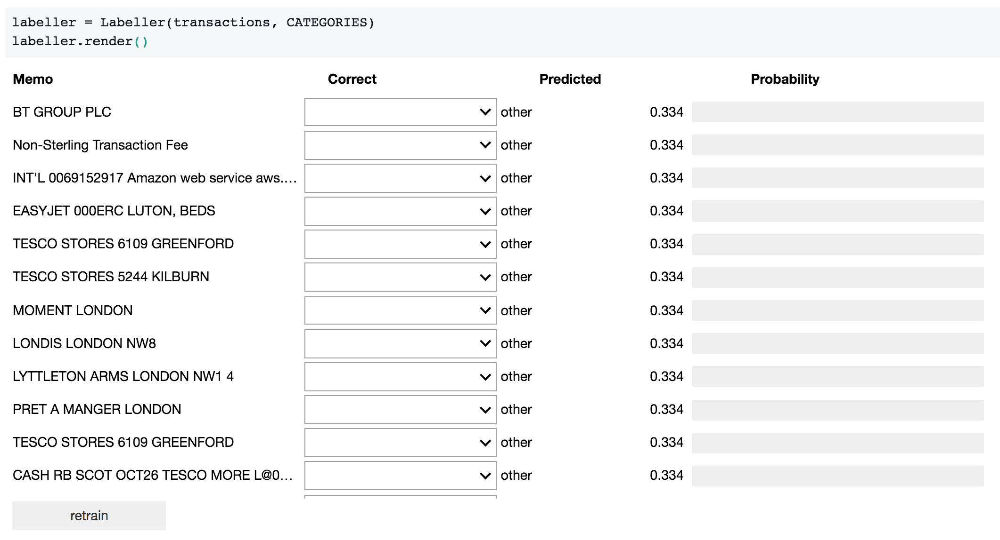

# Jupyter widgets demonstration

This repository implements a Jupyter widget for interactively labelling a
training set to be used in a classifier:

To run the code:

1. Install the dependencies with `pip install -r requirements.txt`
2. Run the notebook `demo.ipnyb`

This has only been tested in a Python 3 environment.

This repository accompanies my talk *Reduce friction in your data science
workflows with Jupyter widgets* at PyconUK 2017. The code shown in the code
is in [labeller.py](./transclass/labeller.py).
